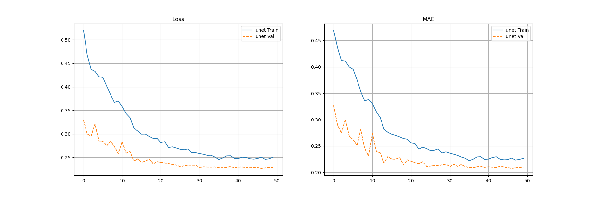
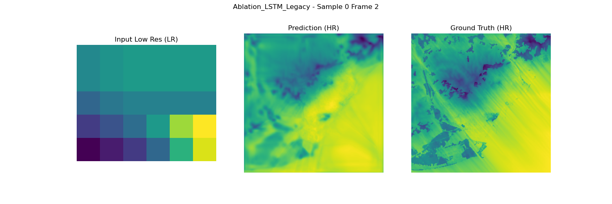
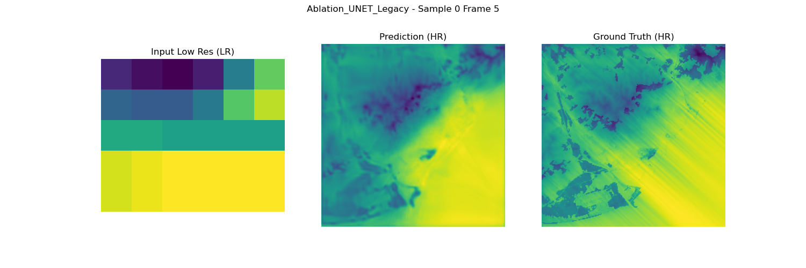
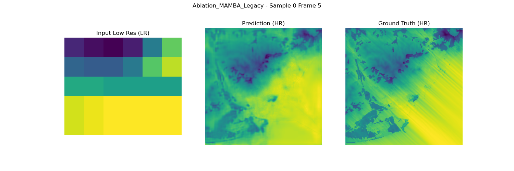

# Reporte de Resultados: Estudio de Ablación (Legacy Architecture)

Este documento resume el desempeño de los modelos evaluados utilizando la arquitectura `Legacy` (sin BatchNormalization, activación ReLU), alineada con la configuración de entrenamiento original.

## 📊 Resumen de Métricas

| Modelo | Parámetros | Best Val Loss | Best Val MAE |
| :--- | :--- | :--- | :--- |
| **LSTM** | ~4.61M | **0.2570** | **0.2280** |
| **UNet** | ~1.96M | 0.2641 | 0.2364 |
| **Mamba** | **~0.68M** | 0.2745 | 0.2351 |

### 💡 Hallazgos Principales

1.  **Costo-Beneficio de Mamba**: El modelo híbrido **Mamba** es sorprendentemente eficiente. Con solo **~680k parámetros** (aprox. 1/7 del tamaño de LSTM y 1/3 de UNet), logra un error (MAE 0.2351) comparable al de la UNet estándar (0.2364). Esto lo convierte en el candidato ideal para despliegue en dispositivos con recursos limitados.
2.  **Precisión vs. Peso**: **LSTM** ofrece la mejor precisión absoluta (menor MAE y Loss), capturando mejor las dependencias temporales complejas, pero a costa de ser el modelo más pesado (~4.6M parámetros).
3.  **Baseline**: La **UNet** estándar se mantiene como un punto medio sólido, pero es superada en eficiencia por Mamba y en precisión por LSTM.

---

## 📈 Comparativa de Entrenamiento

A continuación se muestra la evolución de las métricas durante el entrenamiento para todos los modelos.

---

## 🖼️ Resultados Individuales

### 1. Hybrid UNet-LSTM (Mejor Desempeño)

### 2. Standard UNet (Baseline)

### 3. Hybrid UNet-Mamba (Más Eficiente)

