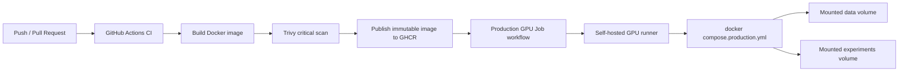

# Simple Production Deployment

## Decision

La opcion mas simple para este repositorio es **Docker Compose + GitHub Actions + GHCR**:

- El proyecto ejecuta jobs cientificos de entrenamiento/evaluacion, no un servicio HTTP permanente.
- Los datos son grandes o restringidos, asi que se montan como volumen y no se copian a la imagen.
- GitHub Actions construye, escanea y publica imagenes inmutables.
- Un runner GPU self-hosted ejecuta el job sin SSH manual.

No se recomienda Kubernetes, Helm o Terraform para esta fase. Agregan coordinacion y coste operativo sin resolver mejor el problema principal: reproducir jobs pesados con datos montados.

## Flow



## Files

- `docker/Dockerfile.tf`: TensorFlow GPU runtime.
- `docker/compose.production.yml`: reproducible production entrypoints.
- `.github/workflows/container.yml`: build, vulnerability scan, image publish.
- `.github/workflows/production-gpu-job.yml`: run the selected production job on a GPU runner.
- `scripts/ops/healthcheck.py`: lightweight runtime health check.

## Containerization

Build locally:

```bash
docker build -f docker/Dockerfile.tf -t weather_urban_downscaling:tf .
```

Run a smoke check:

```bash
docker compose -f docker/compose.production.yml run --rm smoke
```

Validate mounted data before training:

```bash
docker compose -f docker/compose.production.yml run --rm data-health
```

Fetch the latest Open-Meteo ECMWF forecast aligned to the trained LR grid:

```bash
docker compose -f docker/compose.production.yml run --rm forecast-fetch
```

Run operational downscaling inference and write timestamped maps for the alert watcher:

```bash
docker compose -f docker/compose.production.yml run --rm forecast-inference
```

Run the recommended publish experiment:

```bash
docker compose -f docker/compose.production.yml run --rm tiles-heatwave
```

Run the full-frame ablation:

```bash
docker compose -f docker/compose.production.yml run --rm fullframe
```

Generate heatwave alerts from prediction maps:

```bash
docker compose -f docker/compose.production.yml run --rm heatwave-alerts
```

Start the real-time alert watcher:

```bash
docker compose -f docker/compose.production.yml up -d heatwave-alerts-live
```

Start the minimal dashboard:

```bash
docker compose -f docker/compose.production.yml up -d alert-dashboard
```

By default, alert generation reads timestamped `.npy` prediction maps from:

```text
experiments/predictions/
```

Filenames must contain a timestamp such as `2026_07_01_15_00_00`, or you can call `scripts/alerts/generate_heatwave_alerts.py` directly with `--manifest`, where the manifest is a CSV with `time,path` columns.

## CI/CD

The `Container CI` workflow performs:

1. Build the TensorFlow GPU image.
2. Scan the image with Trivy for critical vulnerabilities.
3. Publish immutable tags to GHCR on pushes/tags.

The `Production GPU Job` workflow runs on a self-hosted runner labeled:

```text
self-hosted, linux, gpu
```

Trigger it without SSH:

```bash
gh workflow run production-gpu-job.yml \
  -f run_mode=tiles-heatwave
```

Run a specific immutable image:

```bash
gh workflow run production-gpu-job.yml \
  -f run_mode=tiles-heatwave \
  -f image_ref=ghcr.io/beegroup-cimne/weather_urban_downscaling:sha-<commit_sha>
```

Generate alerts after predictions are available:

```bash
gh workflow run production-gpu-job.yml \
  -f run_mode=heatwave-alerts
```

Start the live alert service without SSH:

```bash
gh workflow run production-gpu-job.yml \
  -f run_mode=heatwave-alerts-live
```

Optional real-time notifications can be enabled on the runner by setting `ALERT_WEBHOOK_URL` outside the repo. The watcher sends the latest alert payload when the level reaches `warning` or higher. Override the threshold with `ALERT_NOTIFY_MIN_LEVEL=watch|warning|severe`.

The alert job writes:

```text
experiments/alerts/latest/alerts_hourly.csv
experiments/alerts/latest/alerts_daily.csv
experiments/alerts/latest/heatwave_events.csv
experiments/alerts/latest/latest_alert.json
experiments/alerts/latest/alerts_summary.json
experiments/alerts/latest/watcher_status.json
```

The dashboard reads these artifacts and serves a local view on port `8765` by default.

## Secrets And Configuration

Do not commit `.env` files, tokens, cloud keys, or dataset credentials.

Use GitHub Actions secrets or the runner host secret manager for any private registry or storage credential. Runtime parameters should be passed through workflow inputs or non-secret environment variables.

Required mounted paths on the GPU runner:

```text
data/
experiments/
```

Expected data shape remains the one documented in `README.md`.

## Resilience

### Health Checks

Container health checks run:

```bash
python scripts/ops/healthcheck.py --runtime
```

Before a real production run, execute:

```bash
docker compose -f docker/compose.production.yml run --rm data-health
```

### Rollback

Images are immutable by commit SHA. To rollback in under 60 seconds, re-run the production workflow with the last known-good image:

```bash
gh workflow run production-gpu-job.yml \
  -f run_mode=tiles-heatwave \
  -f image_ref=ghcr.io/beegroup-cimne/weather_urban_downscaling:sha-<previous_good_commit_sha>
```

For a running bad job, cancel the GitHub Actions run and launch the command above. No server SSH is required.

## Pre-Launch Checklist

1. `Container CI` is green for the commit to deploy.
2. The selected image has an immutable `sha-<commit>` tag in GHCR.
3. `docker compose -f docker/compose.production.yml run --rm data-health` passes on the GPU runner.
4. `data/` contains restricted inputs locally on the runner and no secrets are committed to Git.
5. A previous known-good image SHA is recorded before launching the production run.
