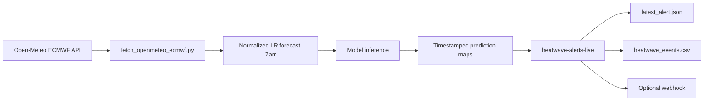

# Real-Time Heatwave Alert Architecture

## Data Source

Production forecast ingestion uses the Open-Meteo ECMWF endpoint:

```text
https://api.open-meteo.com/v1/ecmwf
```

The request is aligned with the training setup:

- model family: ECMWF IFS through Open-Meteo ECMWF forecasts
- temporal step: hourly
- spatial query: fixed AMB centroids matching the LR training grid
- coordinate system: WGS84
- cell selection: nearest
- elevation: `nan`, to avoid Open-Meteo terrain downscaling

## Grid Contract

The trained cache currently uses:

```text
LR shape: 5 x 4
variables: u10, v10, d2m, t2m, lai_hv, lai_lv, tp, ssrd, fal
latitude order: south -> north
longitude order: west -> east
```

The production centroid file is:

```text
config/forecast/amb_era5land_centroids.csv
```

The latitude order follows the trained tensor, not an abstract GRIB convention. This is deliberate: model kernels learned the local coastline/mountain orientation from the cached tensor order.

## Preprocessing

Open-Meteo variables are converted into the trained channel contract:

| Trained channel | Open-Meteo source | Conversion |
|---|---|---|
| `u10` | `wind_speed_10m`, `wind_direction_10m` | meteorological direction to u component |
| `v10` | `wind_speed_10m`, `wind_direction_10m` | meteorological direction to v component |
| `d2m` | `dew_point_2m` | Celsius |
| `t2m` | `temperature_2m` | Celsius |
| `tp` | `precipitation` | mm to m |
| `ssrd` | `shortwave_radiation` | W/m2 to J/m2 per hour |
| `lai_hv` | unavailable | filled with training mean |
| `lai_lv` | unavailable | filled with training mean |
| `fal` | unavailable | filled with training mean |

After conversion, all channels are normalized with `data/processed/stats_config.npz`.

## Operational Flow



## Commands

Inspect the Open-Meteo URL without fetching:

```bash
.venv/bin/python scripts/forecast/fetch_openmeteo_ecmwf.py --dry-run
```

Fetch and preprocess the latest ECMWF forecast:

```bash
.venv/bin/python scripts/forecast/fetch_openmeteo_ecmwf.py
```

Run downscaling inference from the normalized LR forecast:

```bash
.venv/bin/python scripts/forecast/run_operational_inference.py \
  --forecast-zarr data/forecast/openmeteo_ecmwf_lr.zarr \
  --model-type mamba \
  --model-path experiments/models/Tiles_MAMBA_S42_best.h5 \
  --out-dir experiments/predictions
```

Start live alert generation once model predictions are being written:

```bash
docker compose -f docker/compose.production.yml up -d heatwave-alerts-live
```

The minimal operational sequence is:

```bash
docker compose -f docker/compose.production.yml run --rm forecast-fetch
docker compose -f docker/compose.production.yml run --rm forecast-inference
docker compose -f docker/compose.production.yml up -d heatwave-alerts-live
```
